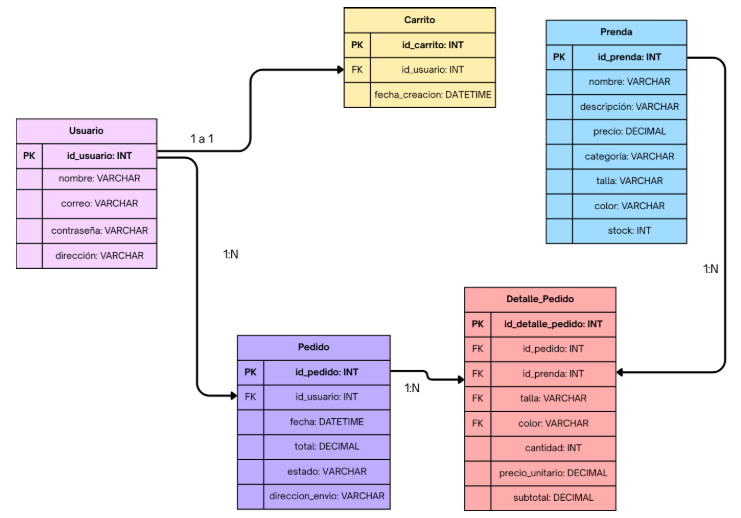

## NovaWear

El sistema propuesto consiste en una plataforma eCommerce web orientada a la venta de ropa juvenil y moda contemporánea. La aplicación permite a los usuarios explorar un catálogo de productos organizados por categorías (mujer y hombre), visualizar detalles de cada prenda, agregar productos a un carrito de compras, guardar productos en favoritos y realizar el proceso de pago de manera segura.

Adicionalmente, el sistema contará con un módulo administrativo que permitirá la gestión de productos, inventario y pedidos, garantizando el correcto funcionamiento de la tienda en línea.

## Integrantes

Laura Johanna Casas - 1202777
Valeria Pantoja Macías - 1202785
Nicolás Caro Betancurt - 1202750

## 1. Objetivo General

Desarrollar una plataforma de comercio electrónico enfocada en la venta de ropa juvenil, con el fin de brindar a los usuarios una experiencia de compra en línea sencilla, clara y segura, que les permita explorar productos, conocer sus características y realizar compras de manera eficiente; dando solución a la necesidad de contar con un sistema organizado que facilite el acceso a este tipo de productos dentro de un entorno digital confiable.

## 2. Contexto de Uso

El sistema está dirigido a cualquier persona interesada en la compra de ropa juvenil a través de internet. En general, está pensado para usuarios jóvenes y adultos que utilizan plataformas digitales y buscan una forma fácil y rápida de adquirir productos en línea.

El sistema será de libre acceso para cualquier usuario que ingrese a la página, permitiendo la visualización del catálogo de productos sin necesidad de registrarse. Sin embargo, para realizar la compra, el usuario deberá crear una cuenta proporcionando un correo electrónico y una contraseña. Una vez registrado, podrá agregar productos al carrito y completar el proceso de compra de manera segura.

## 3. Requerimientos del Sistema
3.1 Requerimientos Funcionales

RF1. Crear usuario:
Esta funcionalidad permite que cada usuario disponga de un perfil propio dentro de la plataforma, garantizando que su información personal y preferencias se almacenen de manera segura. Además, al incluir opciones como registro, inicio de sesión, y recuperación de contraseña, se facilita el acceso controlado al sistema y se protege la integridad de los datos. Esto contribuye a una experiencia personalizada, segura y confiable para cada usuario.

RF2. Gestión de perfil:
Este apartado permite al usuario administrar su información personal dentro de la plataforma. El usuario podrá editar sus datos personales, como información de contacto y dirección de envío, asegurando que los datos utilizados en futuras compras estén actualizados. Asimismo, podrá consultar su historial de pedidos, lo que le permitirá hacer seguimiento de compras anteriores y mantener un control organizado de sus transacciones.

RF3. Visualización de productos:
El sistema ayuda a la visualización completa del catálogo de productos de manera organizada y atractiva para el usuario, facilitando la navegación dentro de la plataforma. Cada producto contará con imágenes de buena calidad y una descripción detallada que incluya información relevante como nombre, precio, tallas disponibles, y colores.

RF4. Búsqueda de productos:
En cuanto a la búsqueda de productos, el sistema incorpora herramientas de filtrado que permiten optimizar la experiencia del usuario. Se incluyen filtros por categoría, los cuales permiten visualizar productos según características como tipo de prenda, color, o talla. Asimismo, se dispone de un filtro por rango de precio, que permite al usuario seleccionar productos dentro de un presupuesto específico, facilitando una búsqueda más precisa y personalizada.

RF5. Gestión del carrito de compras:
El sistema cuenta con un carrito de compras que permite al usuario agregar los productos que seleccione. Dentro del carrito, el usuario podrá modificar la cantidad de unidades de cada producto o eliminar aquellos que ya no desee adquirir.
Además, el sistema mostrará de manera clara el número total de productos añadidos, el precio individual de cada artículo, el subtotal y el valor total de la compra. Esto permitirá al usuario tener un control detallado de su pedido antes de proceder al proceso de pago.

RF6. Procesamiento de compra:
Durante el proceso de compra, el sistema deberá garantizar la seguridad de la información del usuario mediante el uso de una pasarela de pago segura para la realización de la transacción.
Una vez efectuado el pago, el sistema deberá generar una confirmación de compra, la cual podrá mostrarse en pantalla y enviarse al correo electrónico registrado por el usuario. Esta confirmación incluirá un resumen del pedido realizado, detalles de los productos adquiridos, el valor total pagado y la información de envío, sirviendo como comprobante de la transacción.

3.2 Requerimientos No Funcionales

Se definieron los siguientes requerimientos no funcionales:

RNF1. El sistema debe estar disponible 24/7, salvo mantenimientos programados.

RNF2. La plataforma debe ser responsive (adaptable a dispositivos móviles, tablets y computadores).

RNF3. El tiempo de respuesta del sistema no debe superar los 3 segundos en operaciones comunes.

RNF4. El sistema debe garantizar la integridad de los datos almacenados en la base de datos.

RNF5. El sistema debe permitir una escalabilidad básica para soportar un aumento moderado de usuarios.

RNF6. El sistema debe proteger la información personal del usuario conforme a normativas de protección de datos.

## 4. Diagramas UML

Diagrama de Casos de Uso

El diagrama de casos de uso muestra las principales interacciones entre los actores del sistema (usuario, administrador y pasarela de pagos) y las funcionalidades que ofrece la plataforma NovaWear. En él se representan las acciones que puede realizar el usuario, como registrarse, iniciar sesión, ver el catálogo, gestionar el carrito y realizar compras; así como las funciones del administrador para gestionar productos y pedidos. Además, se incluye la interacción con la pasarela de pagos para procesar las transacciones. El diagrama permite visualizar de forma general cómo los usuarios interactúan con el sistema y cómo se relacionan las distintas funcionalidades entre sí.

Diagrama de Secuencia

El diagrama de secuencia representa el proceso de compra dentro de la plataforma NovaWear, mostrando el orden en que interactúan el usuario, el sistema y la pasarela de pagos. En este se visualiza cómo el usuario selecciona productos, los agrega al carrito y procede al pago, mientras el sistema gestiona la información y envía la solicitud a la pasarela de pagos para procesar la transacción. Finalmente, se muestra la confirmación de la compra, evidenciando la secuencia de acciones necesarias para completar el proceso de manera correcta.

## 5. URL del Prototipo
https://www.figma.com/proto/7a6go6iI8TAc55X5vObH0T/Mockcup?node-id=0-1&t=GBLyK1flqgiVamBy-1

## 6. Diseño de Base de Datos

Dentro del diseño de la base de datos del sistema NovaWear, se identifican varias entidades principales que permiten el correcto funcionamiento de la plataforma y el almacenamiento de la información necesaria:

- **Usuario:** 
Almacena la información de cada persona registrada en el sistema, como nombre, correo electrónico, contraseña y datos de contacto. Esta entidad es fundamental, ya que permite la autenticación, gestión de perfil y asociación con otras entidades como pedidos y carrito de compras.

Prenda (Producto):
Contiene la información de los productos disponibles en la tienda, incluyendo nombre, precio, descripción, categoría, talla, color y cantidad en inventario. Esta tabla es clave para la visualización del catálogo y el proceso de compra.

Carrito de compras:
Representa el conjunto de productos que un usuario ha seleccionado antes de realizar la compra. Está asociado directamente a un usuario (relación 1:1) y permite almacenar temporalmente los productos, sus cantidades y el valor total.

Pedido:
Registra las compras realizadas por los usuarios. Incluye información como fecha del pedido, estado, total de la compra y referencia al usuario que lo realizó. Un usuario puede tener múltiples pedidos (relación 1:N).

Detalle de pedido:
Almacena la información específica de cada producto dentro de un pedido, como cantidad, precio y producto asociado. Esta entidad permite desglosar los pedidos en sus componentes individuales

## 7. Documentación del Sistema

Para mantener el proyecto ordenado y evitar confusiones entre los integrantes del equipo, organizamos el código en carpetas separadas según su función. Así cada persona sabe exactamente dónde trabajar sin dañar el trabajo de los demás, de la siguiente manera:

- **`/pages`** → La carpeta pages contiene todos los archivos HTML del sitio. Decidimos poner todas las páginas en una sola carpeta para tenerlas localizadas fácilmente y que cada quien trabajara en su propia página sin afectar la de los demás.

- **`/css`** → La carpeta css contiene los estilos de cada página. Separamos los CSS por página para que el código esté más limpio y si alguien necesita cambiar algo del carrito o la página en la que esté trabajando, solo modifica su propio archivo sin dañar a los demás.

- **`/assets/iconos`** → La carpeta assets tiene adentro una subcarpeta llamada iconos donde guardamos todos los íconos en formato SVG, como el logo, el corazón de favoritos, la bolsa del carrito y el ícono de usuario. Agrupar todos los íconos en un solo lugar hace que todos los integrantes del equipo los encuentren fácilmente.

- **`/img`** → La carpeta img contiene todas las imágenes del sitio, como las fotos de los productos como camisetas, chaquetas y vestidos, y también las imágenes de las secciones grandes como la foto de Kendall Jenner en el hero y las fotos de Explorar mujer y explorar hombre.

- **`/js`** → La carpeta js la dejamos creada pero no la usamos en esta entrega pero la dejamos preparada para después agregar funcionalidad con JavaScript.

Decidimos organizar el proyecto de esta manera por tres razones principales. Primero por orden, así cada cosa está en su lugar y nada anda perdido. Segundo por trabajo en equipo, porque cada persona trabaja en su propia página y sus propios estilos sin molestar a los demás. Tercero para evitar conflictos en GitHub, porque al unir las ramas, no se mezcla el código de uno con el de otro. Y cuarto para que sea fácil de mantener, porque si hay que arreglar algo del carrito, sabemos exactamente que está en pages/carrito.html y en css/carrito.css.

## 8. Instalación y Ejecución

**¿Cómo correr el proyecto?**

El sitio ya está publicado y se puede acceder desde cualquier navegador web en la siguiente URL: [enlaceee]

**¿Qué puede hacer el usuario en el sitio?**

**Página principal (Home):** Al cargar la página, el usuario ve la pantalla de inicio con las colecciones destacadas. Desde el header puede navegar a las secciones de Mujer, Hombre o Lo Nuevo. También tiene acceso a sus favoritos, al carrito y a su cuenta de usuario. Bajando un poco, encuentra la sección de colecciones destacadas con productos en tendencia. También puede explorar las colecciones de mujer y hombre a través de las imágenes grandes, y al final puede suscribirse al newsletter para recibir novedades.

**Página de Mujer y Hombre:** El usuario puede filtrar productos por categoría (chaquetas, vestidos, pantalones, etc.), por talla y por rango de precio. Cada producto se muestra en una tarjeta con imagen, nombre y precio.

**Página de Producto:** Al hacer clic en un producto, el usuario puede ver una imagen más grande del producto, el precio, una descripción corta, seleccionar la talla y la cantidad deseada. Desde esta página puede agregar el producto al carrito o guardarlo en favoritos. También puede ver otros colores disponibles si los hay, los detalles de la prenda, y una sección de "productos que te pueden gustar" con recomendaciones.

**Página de Favoritos:** El usuario puede ver todos los productos que ha guardado como favoritos. Desde aquí puede ver el detalle de cada producto o eliminarlo de su lista de favoritos.

**Página del Carrito:** El usuario puede ver todos los productos que ha agregado al carrito. Para cada producto puede aumentar o disminuir la cantidad, o eliminarlo del carrito. En el lado derecho aparece el resumen de la compra con el subtotal, el costo de envío y el total a pagar. Desde aquí puede seguir comprando (volver al home) o proceder al pago.

**Página de Pago:** Si el usuario decide proceder al pago, debe llenar un formulario con su información personal (nombre, correo, celular, dirección, ciudad, estado, código postal) y los datos de pago (número de tarjeta, fecha de caducidad, CVV). También se muestra un resumen del pedido para que el usuario revise antes de confirmar la compra.

**Página de Pago Confirmado:** Después de realizar el pago, el usuario ve una pantalla de confirmación indicando que su compra fue exitosa.

**Página de Ingresar:** El usuario puede iniciar sesión con su correo electrónico y contraseña si ya tiene una cuenta creada.

**Página de Crear Cuenta:** Si el usuario no tiene cuenta, puede crear una nueva ingresando su nombre, correo electrónico y contraseña.

**Navegación general:** Todas las páginas comparten el mismo header y footer, lo que permite al usuario moverse fácilmente entre las secciones del sitio sin perderse. Además, todo el sitio se puede navegar usando solo el teclado (tecla TAB) y es completamente responsive, adaptándose a cualquier dispositivo como computadores de escritorio, tablets y teléfonos móviles.
